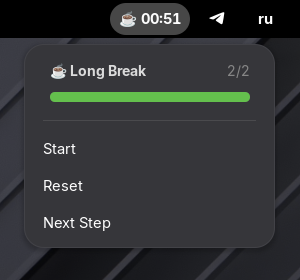

# 🍅 Pomodoro Timer

Simple Pomodoro timer for GNOME Shell 45+ with customizable work sessions and breaks.

## Screenshots



## Features

- 🍅 Work sessions (default 25 min)
- 🌟 Short breaks (5 min)
- ☕ Long breaks (15 min)
- Progress bar and pomodoro counter
- Notifications
- Auto-start next phase
- Customizable durations

## Installation

```bash
cd ~/.local/share/gnome-shell/extensions/pomodoro@igor.dev/
glib-compile-schemas schemas/
```

Enable in GNOME Extensions app.

## Usage

Click the timer in the top bar:

- **Start/Pause** - control the timer
- **Reset** - return to work phase
- **Next Step** - skip to next phase

## Configuration

Open Settings from the extension menu to customize:

- Work time, short break, long break durations
- Long break interval (after X pomodoros)
- Auto-start and notifications

## Default Settings

- Work: 25 min
- Short Break: 5 min
- Long Break: 15 min
- Long break after every 4 pomodoros
